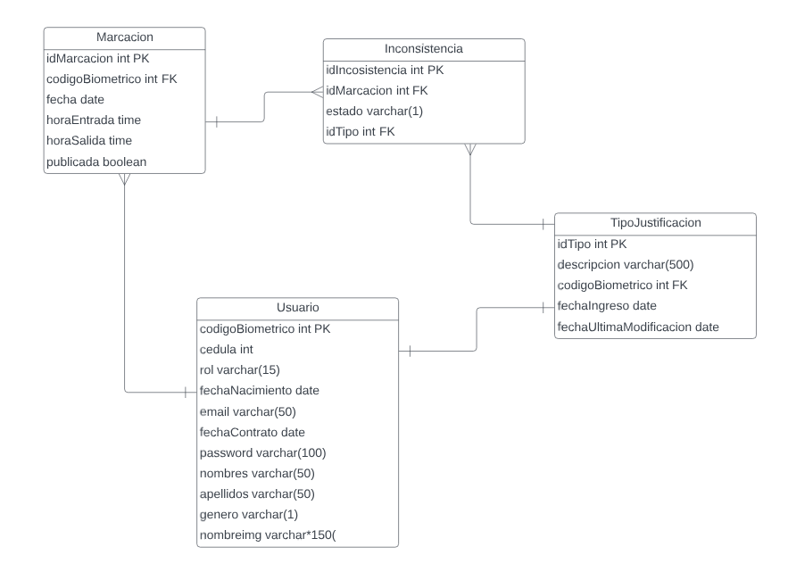

# Sistema de marcaciones de empleados MICABAL SA
### Objetivo
  Creación de un sistema que permite la automatización del control de marcaciones.
### Justificación
  Actualmente el control de las marcaciones (entrada, salida, atrasos) se realiza de manera manual mediante el uso de un dispositivo que registra la información biométrica de cada trabajador de la empresa. Se extrae la información registrada por el dispositivo en un documento pdf mediante la captura de pantallas del software enlazado al dispositivo y luego se entrega la información a personal de recursos humanos que se encarga de revisar e identificar todas las incosistencias encontradas en el registro de las marcaciones. Luego, el trabajor/empleado de la empresa se acerca al personal de recursos humanos para indicar de manera verbal y entregar algún documento (de ser necesario) para que el encargado lo registre en papel. Manejar este tipo de información en papel es delicado, ya que en cualquier momento los papeles se podrían extraviar o destruir.
  Se busca la automatización del manejo de toda la información de las marcaciones con el fin de ofrecer transparencia para el empleado, la optimización del proceso y mejorar la consistencia de la información.
#### Área de uso del sistema
  RRHH
## Diagrama entidad relación

#### Nota: El sistema está siendo desarrollado con motivo de prácticas preprofesionales desde cero para el uso exclusivo de la empresa MICABAL SA
